# Lasting Links 💜  
_A personality‑first dating app focused on meaningful conversations, not appearances._

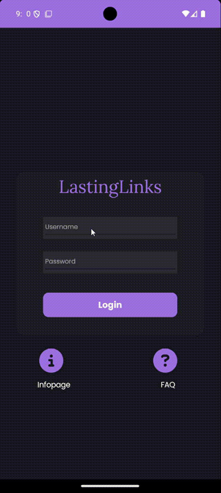 <!-- General walkthrough GIF -->

---

## ✨ Key Features

### ✅ Login
- Validates username (2–25 chars)
- Password must include: 8+ chars, uppercase, lowercase, number, special char
- Error messages appear if validation fails

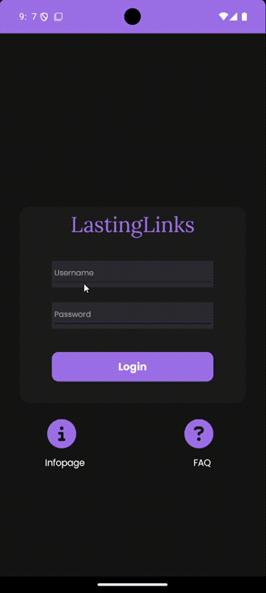

---

### ❓ Info & FAQ
- **Info page** with mission statement and app goals
- **FAQ page** with 10 answers to common user questions

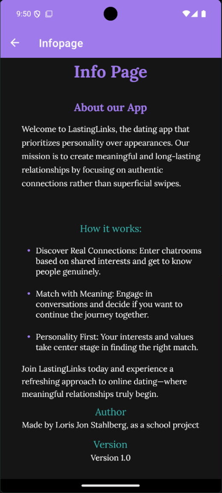

| FAQ Page 1 | FAQ Page 2 | FAQ Page 3 |
|:----------:|:----------:|:----------:|
| 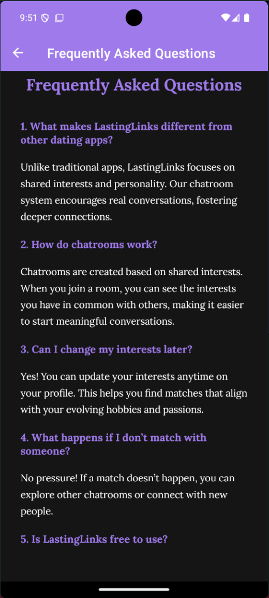 | 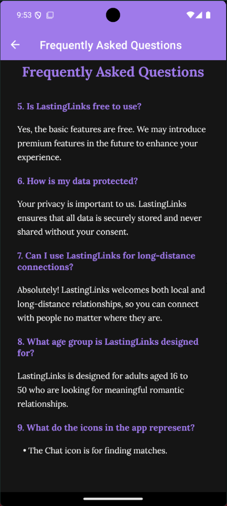 | 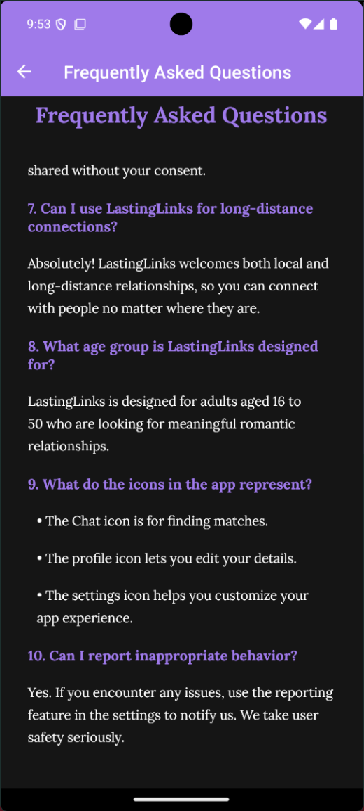 |


---

### 🏠 Home Dashboard
- “Find Matches” card (start matching or enter chat)
- “Your Profile” card (view/edit user profile)
- Bottom navigation bar with 4 sections


---

### 🧍 Edit Profile
- Edit username, birthdate, age range, gender, interests
- Dropdowns and sliders for intuitive input
- Save button to confirm profile changes


---

### 💬 Chat Room
- Match with someone who shares your interests
- See their name, age, and common hobbies
- Real-time conversation (text only)

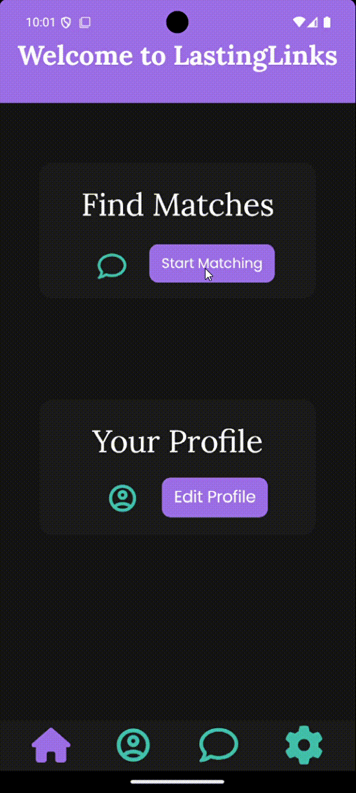

---

### ⚙️ Settings
- Toggle notifications on/off
- Change language (English, German, Spanish)
- “Changes Saved” feedback with animated toast


---

## 🛠️ Tech Stack & Setup

**Built with:**
- .NET MAUI (C# & XAML)
- Visual Studio 2022+
- Target: iOS (tested on iPhone 13)

**Run locally:**

```bash
git clone https://github.com/lorisjon/LastingLinks.git
cd LastingLinks
# Open LastingLinks.sln in Visual Studio
# Select iOS simulator and press Run
```

---

## 🎨 Design Philosophy

- **Dark UI** keeps focus on conversation and adds intimacy  
- **Violet accents** represent emotion & romantic tone  
- **Fonts:**  
  - **Lora**: serif font for warmth and elegance  
  - **Poppins**: clean sans-serif for clarity in UI elements

---

## 📂 Mockups & Storyboards

### 🧩 UI Mockups

| Login Screen | Dashboard | Edit Profile |
|:------------:|:---------:|:------------:|
| 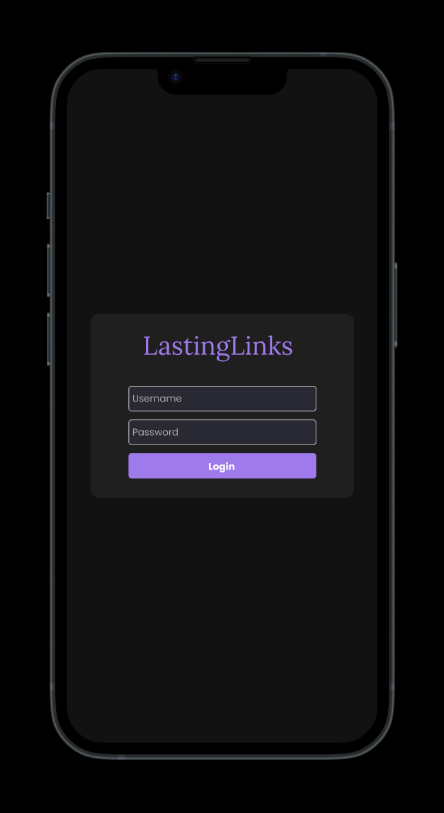 | 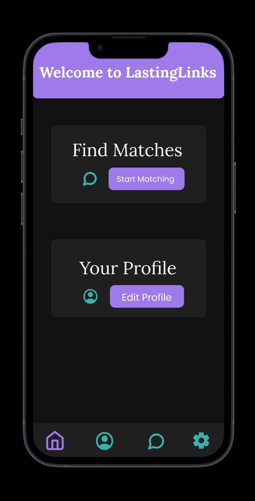 | 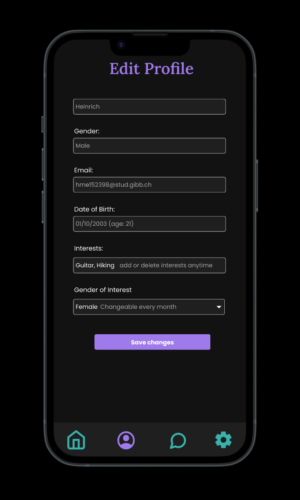 |

| Chat Room | Settings |
|:---------:|:--------:|
| 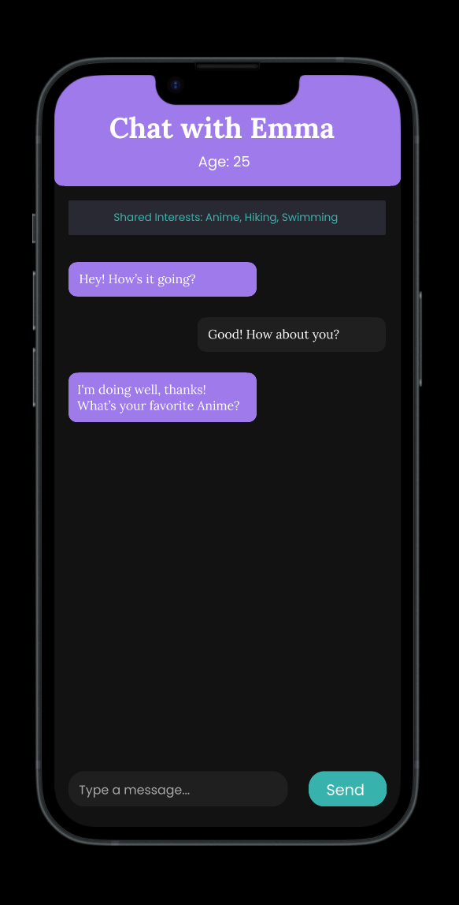 | 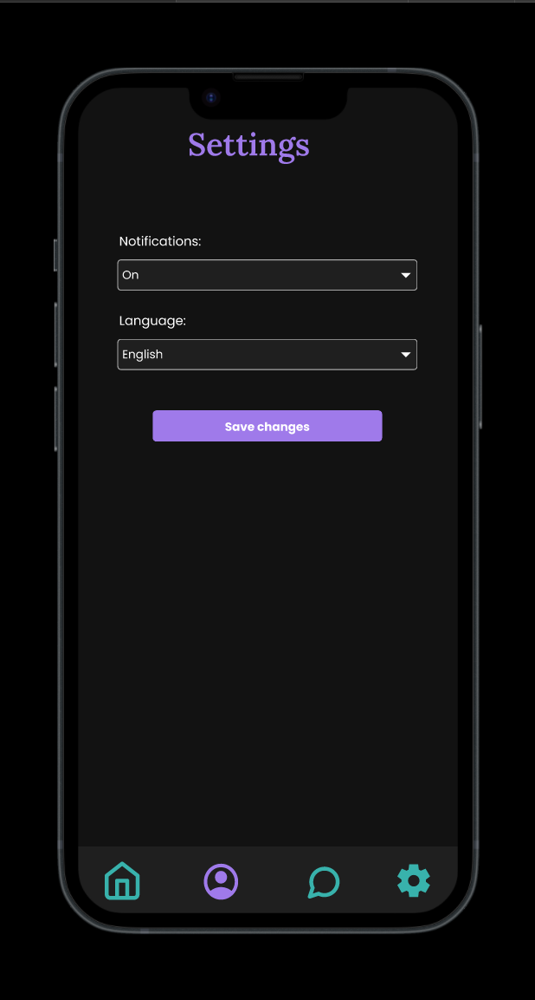 |

---

### 🖼️ FAQ Screenshots

| FAQ Page 1 | FAQ Page 2 | FAQ Page 3 |
|:----------:|:----------:|:----------:|
|  |  |  |

---

### 🎬 Storyboards

#### 🧍 Editing Profile
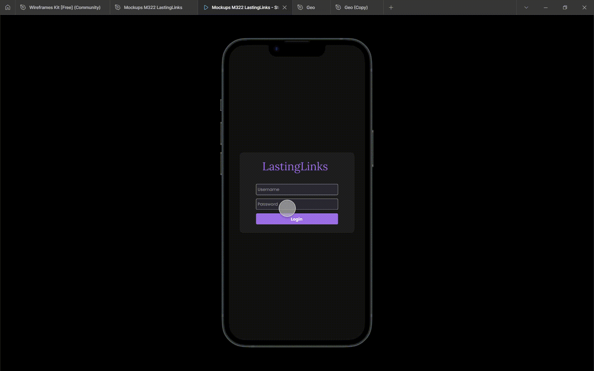

#### 💘 Getting a Match
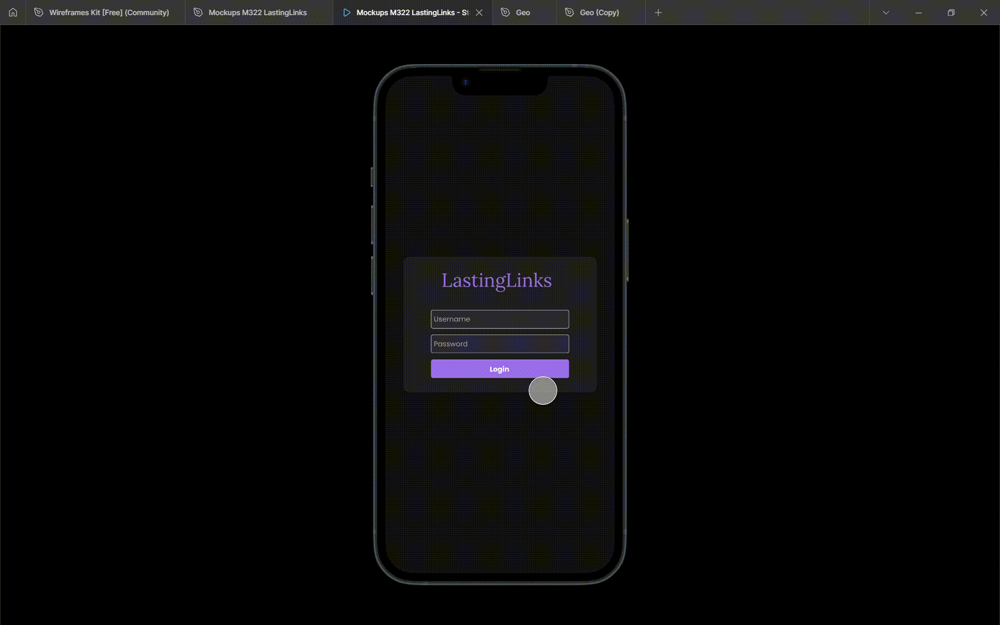

#### ⚙️ Changing Settings
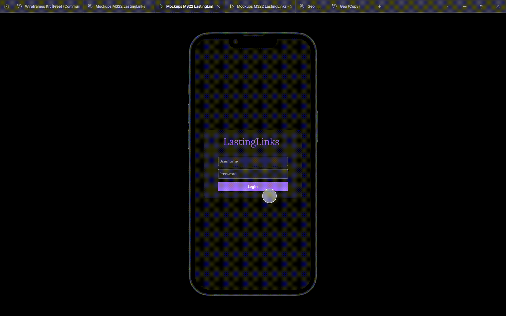


---

## 🚀 Next Steps

- Add cloud-based user accounts  
- Improve profile data persistence  
- Build Android release version  

---

> Made by **Loris Jon Stahlberg** as part of a school project.  
> _This app was designed to explore user-focused mobile development using .NET MAUI._


<!-- Optional link to your personal website -->

<!-- Portfolio: https://your-portfolio.example.com -->
